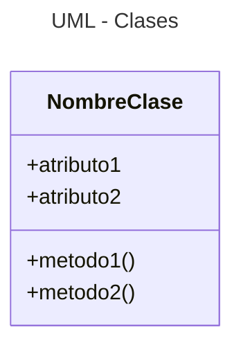
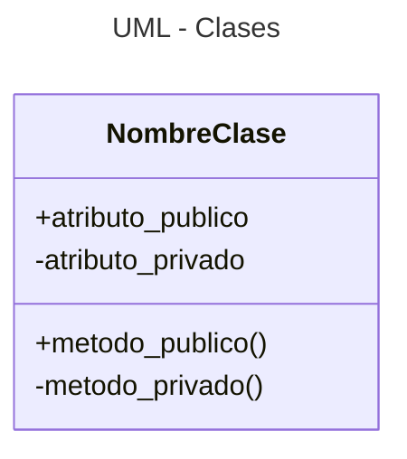

---
tags:
  - Clases
  - UML
  - Markdown
  - Mermaid
  - Documentacion
---


# Clases 


Las **clases** son objetos que poseen atributos y funcionalidad
integrados:

- Los **atributos** son valores guardados de los parámetros, es decir son variables internas de la clase.
- La funcionalidad de la clase es representada por **métodos**, que son funciones específicas de la clase. 


## Definición

<!-- 
Las clases se definen así: 
-->

La definición de la clase es la encargada de definir la estructura interna de la nueva clase,
es decir de darle "formato",
y de indicar sus funcionalidades.
Utiliza la cláusula `class`:

```python title="Clases - Definición "
class NombreClase:
    # inicialización
	def __init__(self, param1, param2, ...):
		self.atributo1 = param1		
		self.atributo2 = param2
```

La palabra `self` es un elemento auxiliar
que apunta a las nuevas "variables" creadas en base a la clase,
llamadas *instancias* u *objetos*.


## Instancias (objetos)

Para crear *instancias* 
se llama a la definición de la clase 
y se asignan valores a todos los parámetros en orden,
 excepto a `self` (éste se omite):

```python title="Clases - Instancia"
nueva_instancia = NombreClase(valor_1, valor_2, ...)
```
Recordar que `self` funciona como un comodín
que hace referencia a cada nueva *instancia*.


En Python a las instancias de clase también se las llama **objetos**.

!!! tip "Objetos en Python"

    Un aspecto interesante de Python es que todos sus elementos 
    (variables, tipos de datos, funciones, etc) 
    son implementados a partir de las clases, 
    es decir **son objetos**.
    Es por este motivo que 
    a las funciones asociadas 
    a cada tipo de variable
    se las llama métodos.


!!! warning "Jergas - Py vs JS "

    No confundir la jerga (terminología) de Python con la jerga de JavaScript (JS):
    en el universo de JS los "objetos"
    son las colecciones de pares *clave-valor*, 
    equivalentes a los *diccionarios* de Python.


## Atributos

Los *atributos* son las "variables" internas que se crean dentro de cada instancia de la clase.

### Atributos públicos

Los *atributos* de la clase son *públicos* por defecto, es decir pueden ser accedidos directamente por su nombre:

```python
nombre_instancia.atributo = valor
variable = nombre_instancia.atributo
```

!!! info "*getters* y *setters*"

    En Python **se prefiere evitar** 
    los métodos 'get' y  'set' para lectura y escritura de atributos,
    por ello lo habitual es declarar públicos los atributos de interés para el acceso externo 
    y dejar privados los atributos con data interna de los métodos. 

    Este hábito contrasta con otros lenguajes donde sí se habitúa crear metodos específicos para leer y escribir la data interna
    (ejemplo: JavaScript).


### Atributos privados

Para hacer que los atributos de la clase sean *"privados"* 
y por tanto sólo puedan ser accedidos desde otros métodos de la misma clase
se les antepone en su definición dos *guiones bajos* (**`__`**):

```python title="Clases - atributos privados"
class NombreClase:
	def __init__(self, param1 , param2, ...):	
        #inicialización (obligatoria)
		self.atributo1    = param1	# atributo público		
		self.__atributo2  = param2	# atributo privado
```

Si se intenta acceder a un atributo privado desde afuera de los métodos de la clase no se disparará un error; 
en cambio se creará un atributo alterno con el mismo nombre. 
Por este motivo hay que evitar a toda costa el intentar acceder a los atributos privados desde afuera. 


### Eliminar atributos

Los atributos pueden ser eliminados llamando al deleter 
`del`:

```python
del nombre_instancia.atributo
```

Sólo se eliminará el atributo en la instancia elegida.
Todas las demás preservarán su atributo intacto.


## Métodos

Los *métodos* son las "funciones" internas de las que podrán disponer las instancias de las clases

### Métodos públicos

Para utilizar los atributos 
de cada instancia de clase 
se añaden los métodos, 
que se definen así:

```python title="Clases - Definición (con métodos)"
class NombreClase:
    # inicialización
	def __init__(self, param1 , param2, ...):	
		self.atributo1 = param1		
		self.atributo2 = param2

	def metodo1(self):
		#código 1

	def metodo2(self):
		#código 2
```

Los métodos se definen de manera muy similar a las funciones,
pero incorporando como primer argumento el objeto `self`.


### Métodos privados

Es posible crear metodos privados definiéndolos con dos giones adelante, igual que se hace con los atributos:

```python title="Clases - Métodos privados"
class NombreClase:
    # inicialización
	def __init__(self, param1 , param2, ...):	
        # codigo inicializacion

    def publico(self):
        self.__privado(self)
        # codigo publico

    def __privado(self):
        # codigo privado
```

Si se intenta acceder a un metodo privado desde afuera de la clase se producirá un error. 

Los métodos privados son útiles para hacer rutinas auxiliares de los métodos públicos de la clase.


## Diagramas UML


Los diagramas UML permiten representar a las clases y sus elementos internos de manera gráfica.
A continuación se muestra la sintaxis usada para crear diagramas UML con Mermaid.js en Markdown:

<div class="grid cards" markdown>



```
    ``` mermaid 
    ---
    title: UML - Clases
    ---
    classDiagram
        NombreClase : +atributo1
        NombreClase : +atributo2
        NombreClase : +metodo1()
        NombreClase : +metodo2()
    ```
```

</div>

El signo **`+`** indica que los atributos y los métodos creados son públicos. 
Los métodos y atributos privados se indican con el signo **`-`**:

<div class="grid cards" markdown>




```
    ``` mermaid 
    ---
    title: UML - Clases
    ---
    classDiagram
        NombreClase : +atributo_publico
        NombreClase : -atributo_privado
        NombreClase : +metodo_publico()
        NombreClase : -metodo_privado()
    ```
```

</div>

## Referencias

[Stack Overflow - What's the pythonic way to use getters and setters](https://stackoverflow.com/questions/2627002/whats-the-pythonic-way-to-use-getters-and-setters)

[HecktorProfe - Herencia múltiple](https://docs.hektorprofe.net/python/herencia-en-la-poo/herencia-multiple/)

[BarcelonaGeeks - Agregación y Composición](https://barcelonageeks.com/python-oops-agregacion-y-composicion/)

[DiagramasUML - Diagrama de clases](https://diagramasuml.com/diagrama-de-clases/)