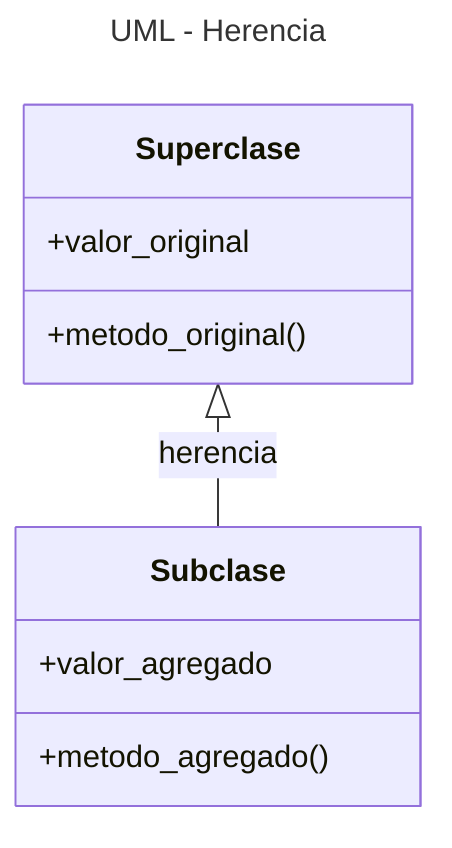
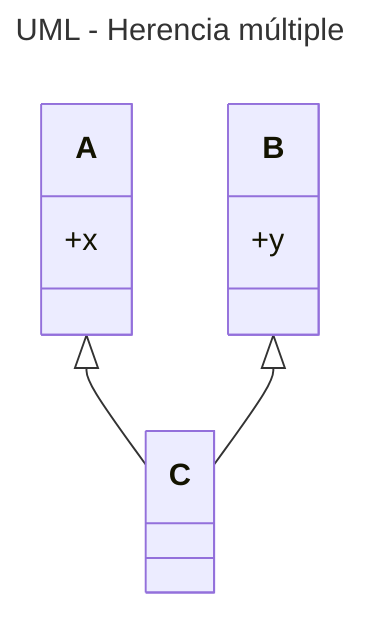

---
tags:
  - Clases
  - POO
  - UML
  - Mermaid
---


# Programacion Orientada a Objetos (*POO*)


La programación orientada objetos es un paradigma de programación
que se basa en el uso extensivo de las clases,
creando **objetos** (las *instancias* de clase) que aglomeran la información interna y traen integradas sus funcionalidades específicas.

Las dos propiedades fundamentales 
de la programación orientada a objetos 
son la herencia y el polimorfismo.
La **herencia** 
permite definir una clase 
que copiará los elementos internos de la clase de referencia
en tanto que 
el **polimorfismo** 
permite implementar variantes de las funcionalidades originales. 


## Herencia

Una clase puede servir de referencia para otras clases. Si la clase de referencia (**superclase**) tiene definidos una serie de atributos y de métodos entonces la clase "hija" (**subclase**) también tendrá definidos  esos mismos métodos y atributos.

### Sintaxis

Las subclases hacen referencia a su superclase en su definición,
la cual se indica como argumento:

```python title="Herencia - Sintaxis (método super)" hl_lines="11 14"
# Clase padre
class Superclase:
    def __init__(self, valor):
        self.valor_original = valor      # atributo

    def metodo_original(self):		# metodo		
        print("Soy el método de la clase padre") 	


# Clase hija
class Subclase( Superclase ):
    def __init__(self, x, y):
        self.valor_agregado = y     # atributo añadido
        super().__init__(x)         # método para heredar atributos

    def metodo_agregado(self):      # metodo de la subclase
        print("Soy el método exclusivo de la clase hija") 
```

El método `super` es el encargado de 
llamar al constructor de la clase padre 
desde la clase hija 
y así poder 
heredar los atributos de ésta. 
Esto también puede hacerse mediante el nombre de la superclase,
invocando a su método `__init__`:

```python title="Herencia - Sintaxis (llamado a superclase)" hl_lines="5"
# Clase hija
class Subclase( Superclase ):
    def __init__(self, x, y):
        self.valor_agregado = y     # atributo añadido
        Superclase.__init__(x)      # método para heredar atributos
```
Si en la clase hija no se añaden atributos no es necesario llamar al constructor (éste se hereda):

```python title="Herencia - Sintaxis (constructor por default)" hl_lines="3"
# Clase hija
class Subclase( Superclase ):
    pass            # herencia automática
```


### Uso

Los objetos creados con la clase hija `Subclase` tienen acceso a los métodos de la clase padre `Superclase`:

```python title="Herencia - Uso"
instancia = Subclase( 4 , -2 )
instancia.metodo_original()
instancia.metodo_agregado()
print(f"Valores: x={instancia.valor_original}, y={instancia.valor_agregado}")
```

### Diagrama UML

A continuación se muestra el formato en UML
para representar la herencia entre clases:


<div class="grid cards" markdown>



    ```mermaid
    ---
    title: UML - Herencia
    ---
    classDiagram
        SuperClase : +valor_original
        SuperClase : +metodo_original()

        SuperClase <|-- SubClase : herencia

        Subclase : +valor_agregado
        Subclase : +metodo_agregado()
    ```

</div>

donde las clases se vinculan con una flecha vacía,
la cual apunta a la clase base (*padre*).


### Herencia múltiple

Una misma subclase puede heredar métodos y atributos de varias superclases al mismo tiempo.

Ejemplo:
```python hl_lines="18 19" title="Herencia múltiple - Sintaxis (constructor por default)" 
# Superclase 'A'
class A:
    def __init__(self):
        self.x = 0
    def procedencia(self):
        print("Este método proviene de A")


# Superclase 'B'
class B:
    def __init__(self):
        self.y = 0
    def procedencia(self):
        print("Este método proviene de B")


# Subclase 'C' , hija de A y B
class C(B, A):      
    pass            # herencia automática (no añade nada)
```

La clase *C* hereda atributos y métodos de ambas clases padre. Si hay algún método o atributo con mobres coincidentes entre padres entonces la clase hija mantendrá la versión del primer padre en asignarse.


```python title="Herencia múltiple - Uso"
# Se crea un objeto de la subclase
instancia = C()

# Los atributos de A y B son accesibles
instancia.x = 7
instancia.y = 10
# Los métodos heredados tienen igual nombre --> se mantiene el primero
instancia.procedencia()     # Da: "Este método proviene de B"
```
En el ejemplo, el método `procedencia` existe tanto en A como en B. Como B se asignó primero como clase padre su versión del método prevalece. 

Si se deseara añadir más atributos a la subclase y usar el método `super` está el problema de superposición de inicializadores. La alternativa es llamar a los inicializadores como método de las superclases.

Ejemplo:

```python title="Herencia múltiple - Sintaxis (llamado a superclase)" hl_lines="4 5"
# Subclase 'C' , hija de A y B
class C(B, A):      
    def __init__(self):     
        B.__init__(self)    # Inicializador de superclase 'B'
        A.__init__(self)    # Inicializador de superclase 'A'
```

La representación de la herencia múltiple en el diagrama UML es la misma que en el caso de la herencia simple:

<div class="grid cards" markdown>




    ```mermaid
    ---
    title: UML - Herencia múltiple
    ---
    classDiagram
        A : +x
        B : +y

        A <|-- C
        B <|-- C
    ```
</div>

### Métodos y funciones útiles

#### `isinstance()`

La función `isinstance()` 
verifica si hay relación entre un objeto (instancia) 
y una clase especificada.

Modo de uso:
```python
retorno = isinstance( objeto, clase )
```

En base al ejemplo previo: *C* es subclase de *A* y de ambas se crean instancias llamadas *a* y *c*:

```python
a = A()
c = C()

print(isinstance(c, C))     # 'True'
print(isinstance(a, A))     # 'True'

print(isinstance(c, A))     # 'True' (debido a la herencia)
print(isinstance(a, C))     # 'False'
```


#### `issubclass()`

La función `issubclass()` verifica si hay relación entre un objeto (instancia) y una clase especificada

Modo de uso:
```python
retorno = issubclass( Subclase, Superclase)
```

En el ejemplo previo:

```python
print(issubclass(C, A))     # 'True': C es subclase de A
print(issubclass(A, C))     # 'False': A es SUPERclase de C

print(issubclass(B, A))     # 'False': A y B NO están vinculados
```

#### `mro()`

El método `mro` (*method resolution order*)
de las clases permite consultar el orden de prioridad
de las superclases.
La superclase más importante se indica primero.

```python
print(Clase.mro())  # orden del más relevante al último
```
En general las clases padre son las más importantes, luego vienen las clases abuelo, etc. Y ante igual jerarquía se le da prioridad a la primera clase en indicarse.

## Polimorfismo

El polimorfismo es el potencial de la subclase para reescribir las propiedades heredadas de la superclase. 

Supongamos el caso de dos clases, una es hija de la otra y ambas definen un método con igual nombre llamado `calculo`.

```python hl_lines="4 8"
class Superclase:
    def __init__(self, valor):
        self.valor = valor
    def calculo(self, x):				# Definicion de un método
        print(f"{self.valor * x} ") 	# Producto


class Subclase( Superclase ):
    def calculo(self, x):				# reescritura del método heredado
        print(f"{self.valor ** x} ") 	# Potencia
```
Obsérvese como el método `calculo`
puede ser reescrito en la clase hija
en tanto que para la clase padre mantiene su fórmula original: 
```python
p = Superclase(4)
p.calculo(3) 	# Producto: da 12

q = Subclase(4)
q.calculo(3)		# Potencia: da 64
```

Con el nombre de clase las instancias pueden acceder tanto a los métodos de las clases padre como a los métodos de las clases hijas.

Sintaxis:
```python
Clase.metodo( instancia, argumentos)    
```

En el ejemplo previo:

```python
p = Superclase(4)       # instancia de clase padre
Superclase.calculo(p, 3)    # Producto: da 12
Subclase.calculo(p, 3)      # Potencia: da 64

q = Subclase(4)         # instancia de clase hija
Superclase.calculo(q, 3)    # Producto: da 12
Subclase.calculo(q, 3)      # Potencia: da 64
```


## Referencias

[Stack Overflow - What's the pythonic way to use getters and setters](https://stackoverflow.com/questions/2627002/whats-the-pythonic-way-to-use-getters-and-setters)

[HecktorProfe - Herencia múltiple](https://docs.hektorprofe.net/python/herencia-en-la-poo/herencia-multiple/)

[BarcelonaGeeks - Agregación y Composición](https://barcelonageeks.com/python-oops-agregacion-y-composicion/)

[DiagramasUML - Diagrama de clases](https://diagramasuml.com/diagrama-de-clases/)