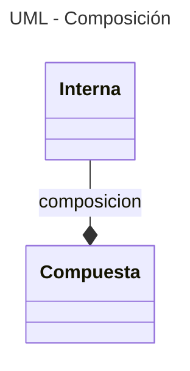
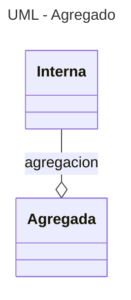
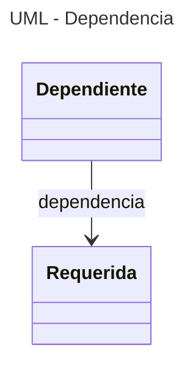
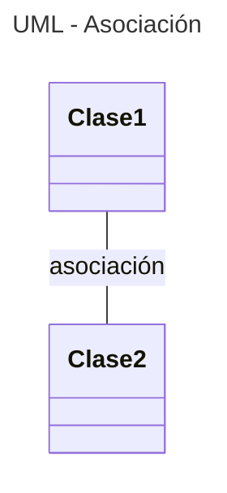
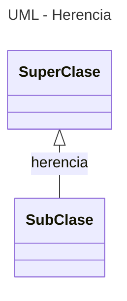

---
tags:
  - Clases
  - POO
  - UML
  - Mermaid
---

# Relaciones entre Clases


## Tipos de relaciones

- Composición
- Agregación
- Asociación
- Dependencia
- Herencia


## Composición

Las clases se pueden componer unas con otras: 

```python
# Clase interior
class Interna:
    def __init__(self):
        self.valor = 0

    def metodo(self):
        print(f"Valor interno: {self.valor}")

# Clase exterior
class Compuesta:
    def __init__(self):
        self.interno = Interna()
```

En este caso 
las dos clases se instancian juntas
creando sus respectivos objetos, 
pero uno de estos objetos
queda contenido adentro del otro.


```python
instancia = Compuesta()           # creación objeto compuesto
instancia.interno.valor = 15       # acceso a atributos internos 
instancia.interno.metodo()         # acceso a métodos internos
# instancia.metodo()              # da ERROR
```

Una desventaja de la composición es la eliminación del objeto interno si el objeto externo se elimina.


La composición se representa
en los diagramas UML
con una línea terminada en un rombo lleno
que apunta a la clase compuesta:

<div class="grid cards" markdown>



    ```mermaid
    ---
    title: UML - Composición
    ---
    classDiagram
        Interna --* Compuesta : composicion
    ```


</div>


## Agregado ("agregacion")

Esta opción es una alternativa a la composición. 
Esta consiste en crear la instancia de la clase interna primero y luego pasarla como argumento para crear la clase exterior:

```python
# clase interior
class Interna:
    def __init__(self):
        self.valor = 0

    def metodo(self):
        print(f"Valor interno: {self.valor}")

# clase exterior
class Agregada:
    def __init__(self, referencia):
        self.objeto = referencia

# objeto de la clase interna
instancia_interna = Interna()   
# clase interna como argumento para la otra
instancia_agregada = Agregada(instancia_interna)
# acceso a atributos y métodos
instancia_agregada.objeto.valor = 15        
instancia_agregada.objeto.metodo()
```

De esta manera los dos objetos tienen existencia independiente
el uno del otro:
si uno es eliminado,
el otro seguirá existiendo.

En el diagrama UML,
la agregación se representa
con una línea terminada en un rombo vacío
que apunta a la clase *exterior*:

<div class="grid cards" markdown>



    ```mermaid
    ---
    title: UML - Agregado
    ---
    classDiagram
        Interna --o Agregada : agregacion
    ```

</div>


## Dependencia

Hay una relación de dependencia
cuando una clase
depende de otra
para poder funcionar.

La dependencia se representa en UML
como una flecha fina que apunta
de la clase dependiente
a la clase requerida:

<div class="grid cards" markdown>



    ```mermaid
    ---
    title: UML - Dependencia
    ---
    classDiagram
        Dependiente --> Requerida : dependencia
    ```

</div>


## Asociación

La asociación es una relación semántica entre dos clases.
Las clases están vinculadas entre sí
pero no hay una jerarquía entre ellas.

La asociación se representa con una línea simple.

<div class="grid cards" markdown>



    ```mermaid
    ---
    title: UML - Asociación
    ---
    classDiagram
        Clase 1 -- Clase 2 : asociación
    ```
</div>


## Herencia


La herencia es una relación jerárquica
donde una clase (*superclase*)
sirve de referencia a la otra (*subclase*),
heredándole sus atributos y sus métodos. 

Es la relación que habilita las propiedades de herencia y polimorfismo explicadas en el [capítulo de POO](poo.md).

Se representa con una flecha vacía apuntando a la clase de mayor jerarquía,
es decir la superclase.


<div class="grid cards" markdown>



    ```mermaid
    ---
    title: UML - Herencia
    ---
    classDiagram
        SuperClase <|-- SubClase : herencia
    ```

</div>


## Referencias

[Stack Overflow - What's the pythonic way to use getters and setters](https://stackoverflow.com/questions/2627002/whats-the-pythonic-way-to-use-getters-and-setters)

[HecktorProfe - Herencia múltiple](https://docs.hektorprofe.net/python/herencia-en-la-poo/herencia-multiple/)

[BarcelonaGeeks - Agregación y Composición](https://barcelonageeks.com/python-oops-agregacion-y-composicion/)

[DiagramasUML - Diagrama de clases](https://diagramasuml.com/diagrama-de-clases/)