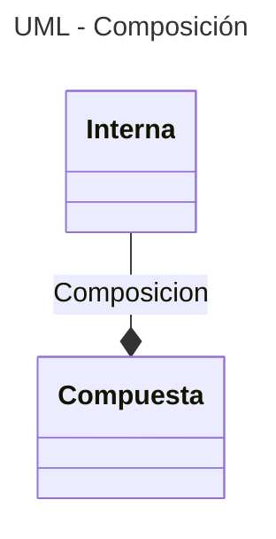
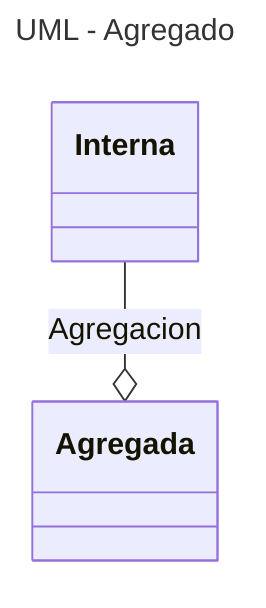

---
tags:
  - Clases
  - POO
  - UML
  - Mermaid
---

# Relaciones entre Clases


## Tipos de relaciones

- Herencia
- Composición
- Agregación
- Asociación
- Dependencia


## Composición

Las clases se pueden componer unas con otras: 

```python
# Clase interior
class Interna:
    def __init__(self):
        self.valor = 0

    def metodo(self):
        print(f"Valor interno: {self.valor}")

# Clase exterior
class Compuesta:
    def __init__(self):
        self.objeto = Interna()
```

En este caso la estructura ylos atributos y métodos ya no pueden solaparse unos con otros cuando hay herencia múltiple. Como contrapartida se complica la estructura de datos.

```python
instancia = Compuesta()           # creación objeto compuesto
instancia.objeto.valor = 15       # acceso a atributos internos 
instancia.objeto.metodo()         # acceso a métodos internos
# instancia.metodo()              # da ERROR
```

Una desventaja de la composición es la eliminación del objeto interno si el objeto externo se elimina.


La composición se representa
en los diagramas UML
con una línea terminada en un rombo lleno
que apunta a la clase compuesta:

<div class="grid cards" markdown>



    ```mermaid
    ---
    title: UML - Composición
    ---
    classDiagram
        Interna --* Compuesta : Composicion
    ```


</div>


## Agregado ("agregacion")

Esta opción es una alternativa superadora a la composición. 
Esta consiste en crear la instancia de la clase interna primero y luego pasarla como argumento para crear la clase exterior:

```python
# clase interior
class Interna:
    def __init__(self):
        self.valor = 0

    def metodo(self):
        print(f"Valor interno: {self.valor}")

# clase exterior
class Agregada:
    def __init__(self, referencia):
        self.objeto = referencia

# objeto de la clase interna
instancia_interna = Interna()   
# clase interna como argumento para la otra
instancia_agregada = Agregada(instancia_interna)
# acceso a atributos y métodos
instancia_agregada.objeto.valor = 15        
instancia_agregada.objeto.metodo()
```

De esta manera los dos objetos tienen existencia independiente
el uno del otro.
Si uno es eliminado,
el otro seguirá existiendo.

En el diagrama UML,
la agregación se representa
con una línea terminada en un rombo vacío
que apunta a la clase *exterior*:

<div class="grid cards" markdown>



    ```mermaid
    ---
    title: UML - Agregado
    ---
    classDiagram
        Interna --o Agregada : Agregacion
    ```

</div>


## Herencia


La herencia cuenta como forma de relación entre las clases.
Es la relación que habilita las propiedades de herencia y polimorfismo explicadas en el capítulo de POO.


## Dependencia

## Asociacion


## Referencias

[Stack Overflow - What's the pythonic way to use getters and setters](https://stackoverflow.com/questions/2627002/whats-the-pythonic-way-to-use-getters-and-setters)

[HecktorProfe - Herencia múltiple](https://docs.hektorprofe.net/python/herencia-en-la-poo/herencia-multiple/)

[BarcelonaGeeks - Agregación y Composición](https://barcelonageeks.com/python-oops-agregacion-y-composicion/)

[DiagramasUML - Diagrama de clases](https://diagramasuml.com/diagrama-de-clases/)