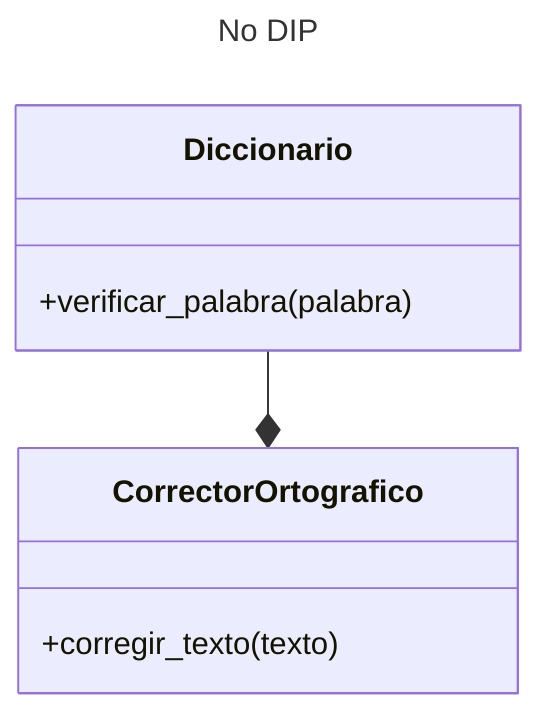
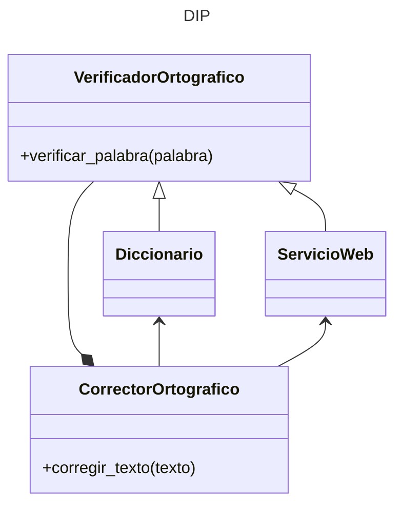

---
tags:
  - Clases
  - ABC
  - POO
  - UML
---


# DIP - Principio de Inversion de Dependencias 

Este principio busca cumplir dos requisitos:

- Los módulos de alto nivel **no** deben depender de los modulos de bajo nivel. Ambos deben depender de abstracciones;
- Los detalles deben depender de las abstracciones y no al revés. 

En general, las clases de alto nivel se encargarán de las generalidades en tanto que las clases de bajo nivel se dedicarán a tareas específicas.

Por ejemplo,
supóngase una clase para un corrector ortográfico
que depende de una clase de bajo nivel
representando un diccionario.



En este ejemplo la clase compuesta `CorrectorOrtografico`
depende de la clase `Diccionario`
y de sus detalles de implementación,
haciendo que la clase compuesta pueda tener errores
si la clase interna cambia.
Por otra parte, 
si fuera necesario introducir otra clase adentro de la composición 
(por ejemplo, una clase `ServicioWeb` ) 
también podrían introducirse errores debido a las posibles variantes de implementación respecto a `Diccionario`.


Este es el código implementado:


```python title="DIP (No implementado)"
# MAL: 'CorrectorOrtografico' (alto nivel) depende de 'Diccionario' (bajo nivel)

# clase bajo nivel
class Diccionario:
    def verificar_palabra(self, palabra):
        pass 

# clase alto nivel 
class CorrectorOrtografico:
    def __init__(self):
        # composicion con una clase de menor nivel
        self.diccionario = Diccionario()

    def corregir_texto(self, texto):
        pass


# Uso de la clase de alto nivel
corrector = CorrectorOrtografico(Diccionario())
```

La solución basada en el principio DIP consiste en crear una clase abstracta
`VerificadorOrtografico`
que sirva de base para todas las clases aplicadas:



de esta forma las clases que conforman la composición (`CorrectorOrtografico`, `Diccionario` y `ServicioWeb`)
pasan a tener la **misma jerarquía** entre ellas
y cualquier cambio en las especificaciones de la clase abstracta
corrige automáticamente a todas estas clases por igual.


Este es el código implementado:

```python title="DIP"
from abc import ABC, abstractmethod

# clase abstracta de referencia
class VerificadorOrtografico(ABC):
    @abstractmethod
    def verificar_palabra(self, palabra):
        pass


# TODAS las otras clases se basan en la clase abstracta

# clase bajo nivel
class Diccionario(VerificadorOrtografico):
    def verificar_palabra(self, palabra):
        pass


# clase alto nivel (extra)
class ServicioWeb(VerificadorOrtografico):
    def verificar_palabra(self, palabra):
        pass


# clase alto nivel
class CorrectorOrtografico:
    def __init__(self, verificador: VerificadorOrtografico):
        # agregacion con una clase abstracta
        # el argumento está "moldeado" por una clase abstracta y por ello aceptará a cualquiera de sus clases hijas
        self.verificador = verificador

    def corregir_texto(self, texto):
        pass


# Uso de la clase de alto nivel
corrector = CorrectorOrtografico(Diccionario())
corrector = CorrectorOrtografico(ServicioWeb())
```


