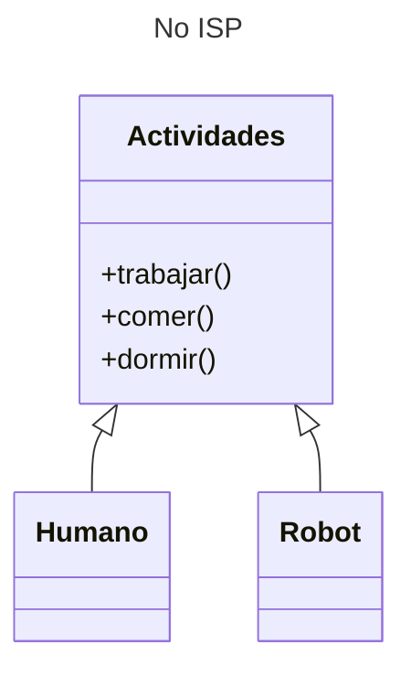
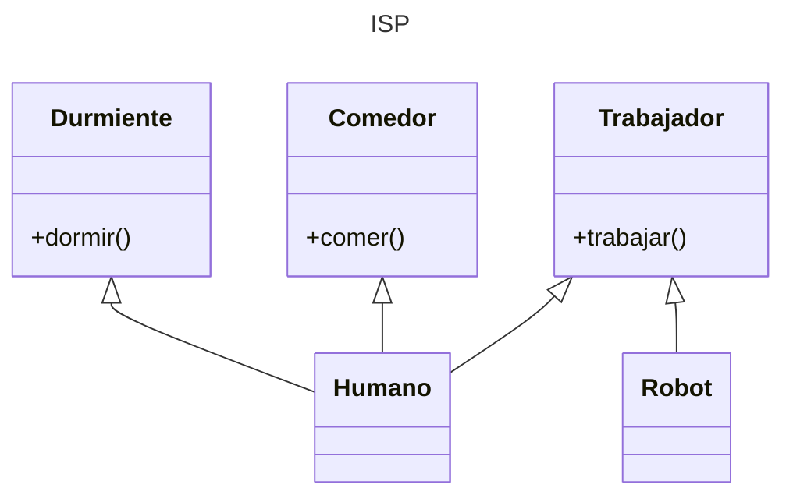

---
tags:
  - Clases
  - ABC
  - POO
  - UML
---

# ISP - Principio de Segregacion de Interfaz

"Ningun usuario debe ser obligado a usar interfaces que no necesite". Hay que eliminar las dependencias que no se necesiten.

!!! info "Interfases en Python"
    Python no usa la creacion de interfases,
    como sucede con otros lenguajes.
    En Python las interfases son implícitas.
 
Supongase que hay dos clases
llamadas `Humano` y `Robot` 
que representan las actividades de conjunto: comer, dormir y trabajar.
Estas actividades son representadas por métodos de una superclase abstracta llamada `Actividades`:

```python title="ISP (No implementado)"
# NO ISP
# Clase abstracta genérica describiendo multiples actividades
class Actividades(ABC):
    def trabajar(self):
        print("Trabajando")

    def comer(self):
        print("Comiendo")

    def dormir(self):
        print("Durmiendo")

# Los humanos trabajan, comen y duermen
class Humano( Actividades ):

# ERROR:
# Los robots no comen ni duermen pero heredan estas actividades
class Robot( Actividades ):
```

El diagrama UML equivalente es el siguiente:



Se observa que la clase `Robot`
hereda los métodos `comer` y `dormir`,
los cuales no tienen sentido para esta clase
dado que los robots no comen ni duermen.


Para prevenir este problema primero se crean
varias clases abstractas separadas
para declarar cada método utilizable por las clases:

```python title="ISP - Clases abstractas"
from abc import ABC, abstractclassmethod

class Trabajador(ABC):
    @abstractclassmethod
    def trabajar(self):
        pass

class Comedor(ABC):
    @abstractclassmethod
    def comer(self):
        pass

class Durmiente(ABC):
    @abstractclassmethod
    def dormir(self):
        pass
```

Cada clase utiliza herencia simple o múltiple
heredando solamente las superclases abstractas que necesita
y luego redefine sus métodos:

```python title="ISP - Herencias selectivas"
# Los humanos trabajan, comen y duermen --> heredan todos
class Humano(Trabajador, Comedor, Durmiente):
    def comer(self):
        print("El humano está comiendo")

    def trabajar(self):
        print("El humano está trabajando")

    def dormir(self):
        print("El humano está durmiendo")


# Los robots no comen ni duermen --> No heredan lo que no necesitan
class Robot(Trabajador):
    def trabajar(self):
        print("El ROBOT está trabajando")

```
De esta manera cada clase sólo tiene acceso a los métodos que tienen sentido para ella.
Así queda el diagrama de clases:




Se verifica que los objetos creados con estas clases
heredan solamente los métodos requeridos por cada una:

```python title="ISP - Instancias"
# instancias de prueba
humano = Humano()
robot  = Robot()

# métodos accesibles para cada objeto
humano.comer()
humano.trabajar()
humano.dormir()

robot.trabajar()

# métodos inexistentes
# robot.comer()         # da error (no está definido)
# robot.dormir()        # da error (no está definido)
```
En resumen:
creando varios métodos abstractos en clases separadas
se previenen problemas de herencia.

