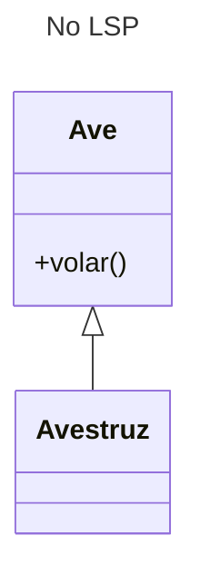
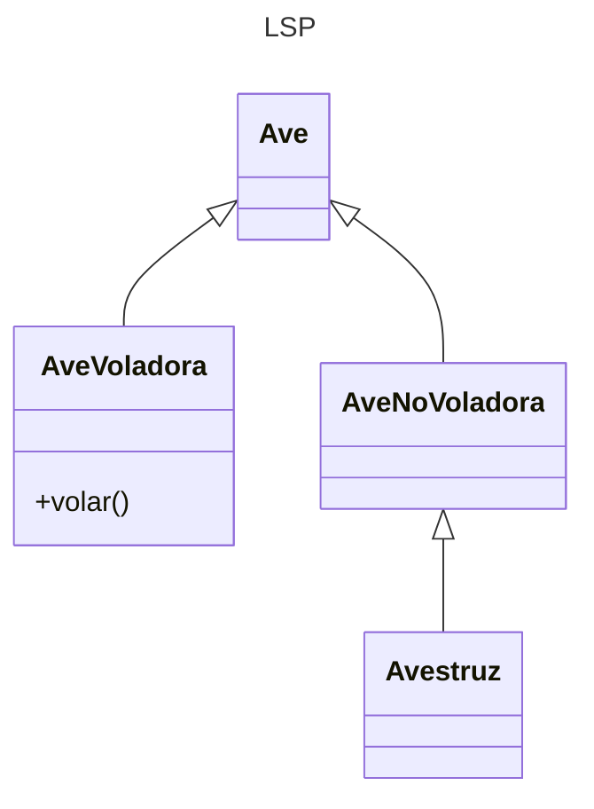

---
tags:
  - Clases
  - ABC
  - POO
  - UML
---


# LSP - Principio de Sustitución de Liskov


Este principio especifica que toda clase debe ser sustituible por su clase base.
Esta regla comprende tanto los casos en que hay herencia de métodos como también los casos en que hay composición o agregación de clases.


Toda subclase hereda **todas** las propiedades de su superclase. Pero esto puede introducir conflictos lógicos bajo ciertas circunstancias.

Ejemplo: capacidad de vuelo de las aves.
Lo primero que se viene a la mente respecto a las aves
su la capacidad de volar...

```python title="LSP (No implementado)"

class Ave:
    def volar(self):
        return "Puedo volar"        # asumimos una propiedad general

class Avestruz(Ave):
    def volar(self):
        return "NO puedo volar"     # hay un conflicto de herencia
```

... pero hay muchas aves que no pueden volar,
como es el caso de los avestruces.


Este es el diagrama UML equivalente:



La solución a este problema consiste en crear distintas clases intermedias alternativas entre sí que se repartan las propiedades conflictivas: 

```python title="LSP"
class Ave:
    pass

class AveVoladora(Ave):
    def volar(self):
        return "Puedo volar"        

class AveNoVoladora(Ave):
    pass   

class Avestruz(AveNoVoladora):
    pass                        # No se hereda la propiedad de vuelo
```

Así queda el diagrama de clases:



## Referencias

[FreeCodeCamp - Los principios SOLID explicados en español](https://www.freecodecamp.org/espanol/news/los-principios-solid-explicados-en-espanol/)