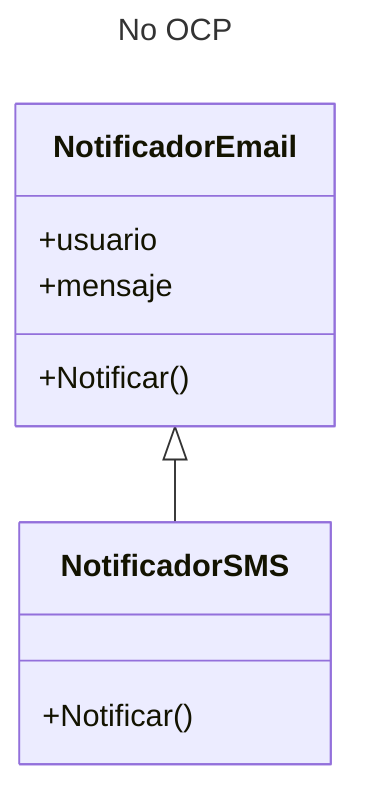
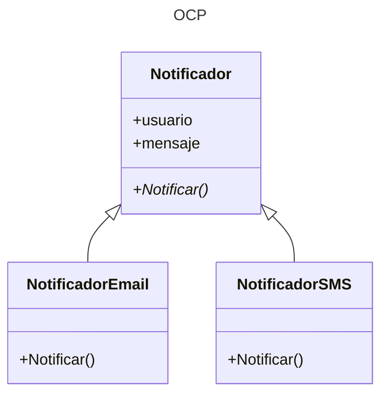

---
tags:
  - Clases
  - ABC
  - POO
  - UML
---


# OCP - Principio de Abierto/Cerrado

Las entidades de software (clases, funciones) deben ser "Abiertas para extension, cerradas para modificacion".
Este principio busca prevenir la modificación
por parte de las clases hijas
de los métodos heredados,
prefiriendo en cambio la escritura desde cero de los métodos.

Imagínese una clase para gestionar notificaciones por e-mail.
Si se deseara crear un sistema para enviar otro tipo de notificaciones
(por ejemplo, un SMS)
a partir de la clase creada
se necesitaría reescribir el método `Notificar`
para implementar la notificación por SMS:


```python title="OCP (No implementado)"
class NotificadorEmail:
    def __init__(self, usuario, mensaje):
        self.usuario = usuario          # objeto con datos del usuario
        self.mensaje = mensaje

    def Notificar(self):
        print(f"Enviando MAIL a {self.usuario.email}")


class NotificadorEmail( NotificadorEmail ):

    def Notificar(self):
        print(f"Enviando SMS a {self.usuario.sms}")
```


Este es el diagrama UML equivalente:



A continuación se modifica el sistena para adaptar el programa a este principio.

La clase `Notificador` (superclase) crea un método para manejar mensajes de notificacion cuyo comportamiento interno no está definido:

```python title="OCP - clase de base"
class Notificador:
    def __init__(self, usuario, mensaje):
        self.usuario = usuario          # objeto con datos del usuario
        self.mensaje = mensaje


    def Notificar(self):                # Metodo genérico
        raise NotImplementedError       # error por comportamiento no definido
```

Las subclases se encargan de adaptar el envio de notificaciones en base a distintas vías de comunicacion: mail, SMS, etc. 
definiendo el comportamiento del método:

```python title="OCP - clases derivadas"
class NotificadorEmail( Notificador )
    def Notificar(self):
        print(f"Enviando MAIL a {self.usuario.email}")

class NotificadorSMS( Notificador )
    def Notificar(self):
        print(f"Enviando SMS a {self.usuario.sms}")

# (otros)
```

De esta manera en vez de reescribir el método de la clase original
se crean clases hijas con el comportamiento deseado para cada situación.


Este es el diagrama UML equivalente:
