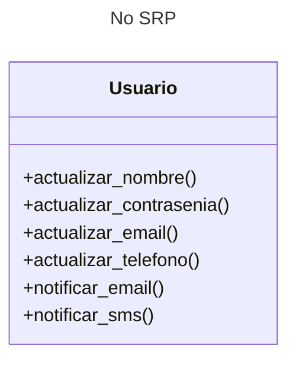
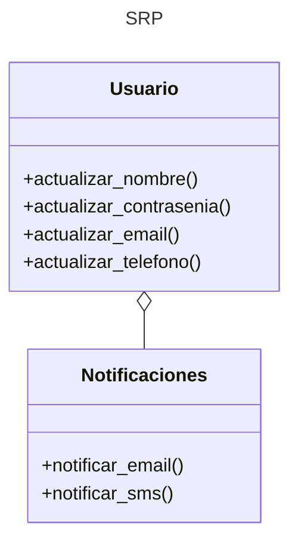

---
tags:
  - Clases
  - ABC
  - POO
  - UML
---


# SRP - Principio de Responsabilidad Unica

Cada clase debe tener una única responsabilidad o tarea. 
Si se necesitan varias responsabilidades o tareas éstas deben repartirse en varias clases.


Imagínese por ejemplo una clase
que representa un usuario
de un servicio informático
con múltiples funcionalidades:


```py title="SRP (No implementado)"
class Usuario:


    def actualizar_nombre(self, valor):
        pass

    def actualizar_contrasenia(self, valor):
        pass

    def actualizar_email(self, valor):
        pass

    def actualizar_telefono(self, valor):
        pass

    def notificar_email(self, mensaje):
        pass

    def notificar_sms(self, mensaje):
        pass
```

En este ejemplo la clase `Usuario` involucra múltiples funcionalidades
bien diferenciadas,
que en este caso son la gestión de los datos persionales
y los mecanismos de comunicación del sistema con el usuario.

Este es el diagrama de clases:




Cualquier agregado en estas funcionalidades, 
como también cualquier agregado de nuevas funcionalidades,
implica el modificar esta clase principal,
agregándole complejidad y dificultando la mantenibilidad.


La alternativa propuesta por el principio SRP
consiste en repartir los métodos entre dos clases:

- `Usuario` para los datos personales de usuario
- `Notificaciones` para implementar los mecanismos de comunicación
con cada usuario.


```py title="SRP"
class Usuario:
    def actualizar_nombre(self, valor):
        pass

    def actualizar_contrasenia(self, valor):
        pass

    def actualizar_email(self, valor):
        pass

    def actualizar_telefono(self, valor):
        pass


class Notificaciones:
    def __init__(self, usuario: Usuario, mensaje):
        self.usuario = usuario         
        self.mensaje = mensaje

    def notificar_email(self, mensaje):
        pass

    def notificar_sms(self, mensaje):
        pass
```

Las dos clases son relacionadas en este ejemplo mediante una agregación donde
la clase `Notificaciones` depende de una instancia de la clase `Usuario`.

Así queda el diagrama de clases:




