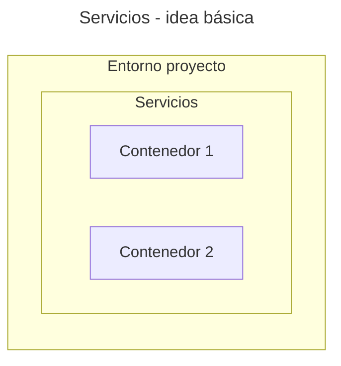

---
date:
    created: 2025-07-01
    updated: 2025-08-26
---

# Compose


## Archivo Compose

El archivo `compose.yml` sirve para definir
los parámetros de creación y funcionamiento
del contenedor (o los contenedores)
del proyecto.
Se trata de un [archivo YAML](../archivos/pyyaml.md),
es decir un tipo de archivos que es habitualmente usado para definir
diccionarios y listas de datos mediante indentado,
lo que lo hace muy fácil de interpretar visualmente.

Una de las grandes ventajas que proporciona
el uso de este archivo
es el despliegue de proyectos enteros
mediante el comando simplificado llamado `compose`.


!!! info "docker-compose.yml"

    Este archivo es llamado en muchos proyectos como `docker-compose.yml`.
    También puede ponérsele la extensión `.yaml`.

## Nombre de proyecto

El campo `name` asigna un nombre al proyecto,
el cual será leído por el gestor de contenedores
y suele ser usado para nombrar a los elementos internos del proyecto.

```yaml title="compose.yml - nombre"
name: mi_proyecto
```

Si este campo no se indica explícitamente
entonces se asigna automáticamente.
Suele tomarse
el nombre de la carpeta que contiene al archivo.

## Sección `services`

La sección `services` es la de uso más habitual
porque en ella se definen los contenedores del proyecto.
Cada proyecto funciona como un entorno aislado
donde los contenedores internos
son incapaces de interactuar
con otros proyectos
ni tampoco
con el sistema anfitrión.

Este es un esquema típico: 



A cada contenedor se le pone un *"nombre de servicio"*
a elección del usuario
y bajo él se definen los parámetros del *container* que se necesiten.
A continuación se muestran
algunos de los parámetros más habituales.


### `image`

Si se necesita usar una imagen preconstruida
que no experimentará cambios internos
se usa solamente el campo `image`.
En este caso, el gestor de contenedores buscará localmente
la imagen indicada por su nombre y versión para crear el contenedor.
Si no se encuentra la imagen pedida,
entonces el gestor buscará e intentará descargar la imagen
desde alguno de los proveedores de imágenes habilitados.

La sintaxis básica es la siguiente:

```yaml title="compose.yml - imagen preconstruida"
services:

  base-datos:         # nombre de servicio - arbitrario
    image: nombre_imagen:tag_version
```
Si no se indica ningún tag entonces se asigna el tag `latest` automáticamente.

Algunos ejemplos de uso para `image`:

- Gestores de bases de datos: MariaDB, PostgreSQL, Redis, MongoDB, etc.
- Servidores proxy, balanceadores de carga: Apache, NGINX, Traefik.
- Frameworks: Wordpress, Mkdocs, Sphynx.


Por ejemplo, para utilizar la versión 9.3 de MySQL:

```yaml title="compose.yml - imagen preconstruida (ejemplo)"
services:

  base-datos:    # nombre de servicio - arbitrario
    image: mysql:9.3.0  # tag: '9.3.0'
```


### `build`

Si se necesita crear una imagen a medida de una aplicación,
o se necesita instalar componentes adicionales a la imagen
entonces se usa el campo `build` ("construir").
Este campo indica la ruta a un archivo Dockerfile
que servirá como referencia para crear la nueva imagen
a partir de una preexistente.
Si la imagen preexistente no existe
entonces se la descarga automáticamente.

```yaml title="compose.yml - construir imagen"
services:

  nueva-imagen:             # nombre de servicio - arbitrario
    build: ruta_dockerfile  # ruta relativa al Dockerfile
```

El nombre asignado a la imagen modificada
es una composición del nombre del proyecto
y del nombre de servicio. 

!!! tip "Etiquetar imágenes"

    Si `image` y `build` son indicados en el mismo contenedor
    entonces se creará una nueva imagen
    siguiendo los pasos indicados por el Dockerfile
    y a ésta se la nombrará con el nombre y etiqueta
    especificados por el campo `image`.
    Si la etiqueta se omite se asigna automáticamente el tag `latest`.

    Ejemplo:
    ```yaml title="compose.yml - construir imagen y etiquetar"
    services:

    nueva-imagen:
        build: .
        image: mi-imagen:v1.0
    ```

### `container_name`

El nombre del contenedor es un parámetro opcional
que sirve para gestionar el contenedor desde la terminal
mediante comandos específicos.
Funciona como un identificador único del contenedor
en el sistema local
y por tanto no puede repetirse
entre varios contenedores existentes.

Ejemplo de uso:

```yaml title="compose.yml - contenedor con nombre"
services:

  base-datos:    
    image: mysql:9.3.0 
    container_name: contenedor_mysql
```


## Comando Compose

El comando Compose interpreta el archivo `compose.yml` y con el crea,
ejecuta, lee y borra los contenedores indicados en el proyecto.
La terminal debe estar ubicada en la ruta del archivo para funcionar.

!!! info "Implementaciones"

    Dependiendo de la implementación del comando Compose instalada en el sistema,
    el comando se debe llamar como:

    ```bash
    docker-compose comando  # Docker - versiones viejas / paquete externo
    docker compose comando  # Docker - versiones nuevas
    podman-compose comando  # Podman - Paquete externo
    podman compose comando  # Podman Desktop - extension
    ```

    Elegir la variante que corresponda según el componente instalado en el sistema.
    En este tutorial se asumirá que es `podman compose comando` 


### Creación y arranque

El proyecto se crea con el comando `up`.

```bash title="compose - creación"
podman compose up
```

Este comando descarga la imagen indicada por el Dockerfile
en caso de ser necesario y crea la imagen personalizada.
Luego pone en marcha al contenedor
y muestra los mensajes de log a medida que se producen.


El comando `up` no reconstruye la imagen en caso de modificarse la rutina Python. Para forzar la reconstrucción hay que agregar la opción `build`:

```bash title="compose - creación (forzar construcción)"
podman compose up --build
```

### Sólo arranque

La puesta en marcha en segundo plano se realiza con el comando `start`:

```bash title="compose - arranque"
podman compose start
```
En este caso se omite la construcción de los contenedores.


### Registro

La consulta del registro de *logs* pasados se hace con `logs`:

```bash title="compose - registros"
podman compose logs
```

Los *logs* de cada contenedor
también se pueden consultar desde el cliente gráfico
tanto de Docker como de Podman.


### Borrado

El proyecto se elimina con el comando `down`:


```bash title="compose - borrado"
podman compose down
```

Este comando apaga los contenedores del proyecto y los elimina.


<!-- 
## Secciones opcionales

A veces se necesitan crear secciones adicionales en el proyecto.
Algunas de ellas son:


### `volumes`

Los [volumenes](volumenes.md) son elementos usados
para guardar los datos
de los contenedores
en el sistema anfitrión.
Si los volumenes requieren ser configurados
o se importan desde otros proyectos
entonces la sección `volumes` es creada.


### `networks`

Las *networks* son elementos
que sirven para interconectar varios contenedores.
Si se crean *networks* en el proyecto
o se importan desde otros proyectos
entonces se crea la sección `networks`.


### `include`

La sección `include` es de uso opcional y
sirve para apuntar a otros archivos Compose,
incluyendo su contenido
de manera automática
dentro del proyecto actual.

Uso típico:

```yaml title="compose.yml - inclusion"
include:
  - subproy_1/compose.yml
  - subproy_2/compose.yml
```

No todas las implementaciones del comando Compose
soportan su uso.

 -->


