# Dependencias entre contenedores

De manera predefinida
se asume que los distintos contenedores del proyecto
funcionan de manera independiente unos de otros.
Por este motivo el programa gestor
intenta poner los contenedores en marcha
de manera paralela de ser posible,
y sino se lo hace en un orden arbitrario.
Esto no no siempre es admisible
debido a que a veces
algunos contenedores dependen de otros
para funcionar correctamente.


## Dependencia básica


Para aquellos casos donde se requiera
que unos contenedores arranquen después que otros
se utiliza el campo
`depends_on`:


```yaml title="compose.yml - dependencia (simple)"
services:

  primero:
    image: imagen_1

  segundo:
    image: imagen_2
    depends_on: 
    - primero
```

Durante el despliegue
el segundo contenedor
se crea después del primero.
Durante la eliminación
el segundo contenedor
es removido primero.

<!-- 
El diagrama de tiempos
toma una forma como esta:

```mermaid
gantt
    title Dependencia simple
    dateFormat X
    axisFormat %s
    tickInterval 1day

    section primero
    arranque   : 0, 4
    section primero
    funcionamiento   : 4, 15
    section primero
    parada  : 15, 18

    section segundo
    arranque   : 4, 6
    section segundo
    funcionamiento   : 6, 13
    section segundo
    parada  : 13, 15
```


-->

Un contenedor determinado puede depender 
de múltiples servicios al mismo tiempo.
Por ejemplo, un contenedor podría depender
de otros dos contenedores ya inicializados
para poder funcionar:


```yaml title="compose.yml - dependencia (múltiple)"
services:

  primero:
    image: imagen_1

  primero-bis:
    image: imagen_1bis

  segundo:
    image: imagen_2
    depends_on: 
    - primero
    - primero-bis
```
<!-- 
entonces el diagrama de tiempos
del arranque toma una forma como ésta:

```mermaid
gantt
    title Dependencia múltiple
    dateFormat X
    axisFormat %s

    tickInterval 1day
    
    section primero
    arranque   : 0, 4
    section primero
    funcionamiento   : 4, 15
    section primero
    parada  : 15, 18

    section primero_bis
    arranque   : 1, 3
    section primero_bis
    funcionamiento   : 3, 15
    section primero_bis
    parada  : 15, 17

    section segundo
    arranque   : 4, 6
    section segundo
    funcionamiento   : 6, 13
    section segundo
    parada  : 13, 15
```


 -->

El servicio `segundo` siempre
se despliega luego que los otros dos
ya hayan arrancado.
También es detenido por completo primero
antes que los otros dos comiencen su parada.


## Opciones avanzadas

A las dependencias de servicios
se les puede configurar varias opciones adicionales:

```yaml title="compose.yml - dependencia (avanzado)"
services:

  primero:
    image: imagen_1

  segundo:
    image: imagen_2
    depends_on: 
        primero:
            restart: true
            condition: service_started  # valor default
            required: true              # valor por default
```

1. El parámetro `condition` admite varias opciones
repecto al servicio apuntado:

    - `service_started`: el servicio debe haber arrancado
    (opción predefinida);
    - `service_healthy`: el servicio debe estar funcionando correctamente, esto se comprueba con un test específico;
    - `service_completed_successfully`: el servicio debe completarse exitosamente.

2. El parámetro `restart` ordena el reinicio del contenedor actual
en cuanto el servicio requerido esté listo.

3. El parámetro `required` especifica si es obligatorio
que el servicio apuntado haya sido arrancado o esté disponible.
Si es seteado como `false` entonces 
el comando `compose` sólo advertirá en caso
que el servicio requerido no está disponible,
no inició o finalizó de manera incorrecta.


## Test de servicio

Los tests de servicio ayudan
a verificar que los contenedores
requeridos por los demás estén funcionando adecuadamente.
Sólo cuando los tests requeridos sean exitosos
se ponen en marcha los contenedores dependientes.


### Definición

Los tests incorporados en las imágenes
se definen adentro del archivo `Dockerfile`
mediante la cláusula `HEALTHCHECK`:

```dockerfile title="Dockerfile - definir healthcheck"
HEALTHCHECK [opciones] CMD comando_predefinido
```
Nótese que esta cláusula
se usa en combinación con la cláusula `CMD`.

#### Opciones

Las opciones permitidas
y sus valores predefinidos
son los siguientes:

| Opción | Valor *default* |
|:---|:---:|
| `--interval=DURACION` |  `30s` |
| `--timeout=DURACION`  |  `30s` |
| `--start-period=DURACION`   | `0s` |
| `--start-interval=DURACION` | `5s` |
| `--retries=INTENTOS` | `3` |

Los tiempos son medidos *por default* en segundos (`s`).
También pueden declararse en minutos (`m`),
horas (`h`), días (`d`),
etcétera.


#### Valor de retorno

El valor de salida del comando es el que indica al sistema
si el test fue exitoso o no.
Los valores posibles son:


|Valor retorno| significado|
|:---:|:---|
|`0`| *success* - test correcto |
|`1`| *unhealthy* - test fallido |
|`2`| *reserved*  (no utilizar) | 


#### Ejemplos de uso

Por ejemplo, 
para que el test sea reintentado cada 5 minutos
y su duración no pase de 3 segundos:

```dockerfile title="Dockerfile - definir healthcheck (ejemplo)"
HEALTHCHECK --interval=5m --timeout=3s \
  CMD comando_healthcheck || exit 1
```


En caso de requerirse la anulación del chequeo interno
se escribe simplemente `NONE`:

```dockerfile title="Dockerfile - healthcheck bypasseado"
HEALTHCHECK NONE
```

#### Healthcheck con Python

Si el *healthcheck* de la imagen
está implementado dentro de una rutina de Python
entonces la forma del comando sería algo como:

```dockerfile title="Dockerfile - healthcheck en Python"
HEALTHCHECK --interval=5m --timeout=3s \
  CMD python rutina_healthcheck.py
```

en tal caso se requiere
que los valores de retorno
sean acordes con el resultado del test.

Si en cambio se utiliza un comando o test
que pueda fallar en el proceso
(por ejemplo Pytest)
entonces el comando quedaría así:

```dockerfile title="Dockerfile - healthcheck (otros comandos)"
HEALTHCHECK --interval=5m --timeout=3s \
  CMD pytest carpeta_tests/ || exit 1
```


### Uso 


El uso básico del *healthcheck*
se establece en el archivo `compose.yml`.


#### Básico

Eligiendo la condición `service_healthy`
se ordena la ejecución del test predefinido:

```yaml title="compose.yml - con healthcheck (default)" hl_lines="8-10"
services:

  primero:
    image: imagen_1

  segundo:
    image: imagen_2
    depends_on: 
        primero:
            condition: service_healthy  
```

Se asume que el servicio apuntado 
tiene ya definido un test de funcionamiento,
de otro modo la ejecución fallará.


<!-- #### Sobreescribir chequeos -->

#### Modificación


Mediante el parámetro `healthcheck`
se puede cambiar
qué comando de *test* realizar
sobre el contenedor elegido
y modificar sus opciones de ejecución:

```yaml title="compose.yml - con healthcheck (custom)" hl_lines="5-12"
services:

  primero:
    image: imagen_1         
    healthcheck:
        # configuraciones custom
        test: ["CMD-SHELL", "comando_test_custom"]
        start-period: 10s   # demora para el primer intento
        interval: 10s       # intervalo entre intentos
        timeout: 60s        # tiempo limite de test
        retries: 5          # nº máximo de reintentos  
        disabled: false     # bypass del test - desactivado por default

  segundo:
    image: imagen_2
    depends_on: 
        primero:
            condition: service_healthy  
```

De esta manera el gestor de contenedores verifica
que el primer contenedor funcione adecuadamente
antes de intentar la puesta en marcha del segundo.

Se sobreentiende que la imagen del primer contenedor
debe disponer de los comandos de prueba pedidos,
de otra manera la ejecución falla.

<!-- 
### Chequeo por *default*
 -->


## Referencias


[Docker Docs - Compose file reference - depends_on](https://docs.docker.com/reference/compose-file/services/#depends_on)


[Docker Docs - Compose file reference - Healthcheck](https://docs.docker.com/reference/compose-file/services/#healthcheck)

[Docker Docs - Dockerfile reference - Healthcheck](https://docs.docker.com/reference/dockerfile/#healthcheck)