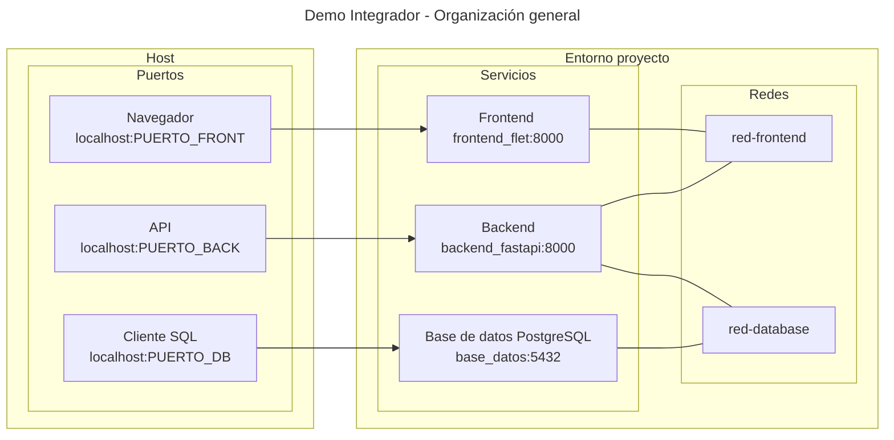

# Demo integrador - Tabla de personas


Se crea un proyecto integrador
imitando la organización
de un servicio monolítico práctico.

Se utilizan todo tipo
de recursos disponibles:

- Port mapping;
- Networks;
- Variables de entorno;
- Secrets;
- Argumentos de imagen.


## Introducción

Se implementa una página web dinámica
que muestra datos artificiales
de personas ficticias
y un botón flotante.
Cada vez que se pulsa el botón
se inventan los datos
de una nueva persona
y se agregan
en una nueva fila a la tabla.
Los datos se almacenan
en una base de datos SQL.


## Organización del proyecto

El proyecto se despliega en tres contenedores:
uno para el servidor de la *webapp* (frontend),
uno para el servidor *backend*
y uno para la base de datos.




La API del *backend*
admite peticiones en dos URL *paths*:
`/leer_todos` para pedir todos los datos existentes
y `/nuevo` para ordenar la creación
de un nuevo registro de usuario. 
El servicio *frontend*
realiza estas mismas peticiones a la API
cada vez que el usuario pulsa el botón flotante.

Se dejó abierto el acceso a la API del *backend*
y a la base de datos
con fines didácticos.

## Configuración

La contraseña de la base de datos
se asigna con ayuda de un elemento *secret*.
El resto de las variables de configuración
se asignan mediante variables de entorno.


## Arbol del proyecto


Los servicios de *frontend* y *backend*
están integramente escritos en Python.
Se eligió como gestor de SQL
una imagen PostgreSQL,
aunque podría haberse elegido MaríaDB o MySQL.

```bash title="Integrador - Árbol de archivos"
.
├── frontend
│   ├── app
│   │   ├── main.py
│   │   └── tabla_personas.py
│   ├── Dockerfile
│   └── requirements.txt
├── backend
│   ├── app
│   │   ├── main.py
│   │   ├── persona.py
│   │   └── sql.py
│   ├── Dockerfile
│   └── requirements.txt
├── .env
├── compose.yml
└── secreto.txt
```

## Archivo de configuración

El despliegue se configuró
mediante un único archivo `compose.yml`.
En él se especificaron
todos los servicios y elementos auxiliares necesarios.


```yaml title="Integrador - compose.yml"
--8<-- "demos/contenedores/integrador/compose.yml"
```

Las variables de entorno
usadas para mapeo de puertos
se cargaron en el archivo `.env`.
Valores de ejemplo:


```yaml title="Integrador - archivo .env"
--8<-- "demos/contenedores/integrador/.env"
```


## Frontend


El servicio de *frontend*
se encarga de proporcionar una pagina web dinámica
construida con el framework **Flet**.
Este servicio interactúa
con el servicio de *backend*
haciendo peticiones HTTP
con ayuda del paquete **requests**.


???+ example "Archivos del frontend"

    ```txt title="Frontend - requirements.txt"
    --8<-- "demos/contenedores/integrador/frontend/requirements.txt"
    ``` 

    ```dockerfile title="Frontend - Dockerfile"
    --8<-- "demos/contenedores/integrador/frontend/Dockerfile"
    ```

    ```py title="Frontend - main.py"
    --8<-- "demos/contenedores/integrador/frontend/app/main.py"
    ```


    ```py title="Frontend - tabla_personas.py"
    --8<-- "demos/contenedores/integrador/frontend/app/tabla_personas.py"
    ```


## Backend

El backend implementa un servidor HTTP
con ayuda del framework **FastAPI**.
Para interactuar con la base de datos
utiliza el paquete **SQLModel**,
el cual permite diseñar las tablas SQL e implementar
tanto el guardado como la lectura de datos
mediante clases pedefinidas,
sin necesidad de agregar código SQL.
Por último, los datos de los registros
se inventan con ayuda
del paquete **Faker**,
que inventa datos de personas ficticias
con un simple llamado a un método predefinido. 


???+ example "Archivos del backend"

    ```txt title="Backend - requirements.txt"
    --8<-- "demos/contenedores/integrador/backend/requirements.txt"
    ``` 

    (**psycopg2** es requerido
    para poder establecer la conexión
    con la base Postgres,
    sin embargo no requiere
    ser llamado explícitamente
    por la rutina de Python).

    ```dockerfile title="Backend - Dockerfile"
    --8<-- "demos/contenedores/integrador/backend/Dockerfile"
    ```

    ```py title="Backend - main.py"
    --8<-- "demos/contenedores/integrador/backend/app/main.py"
    ``` 

    ```py title="Backend - persona.py"
    --8<-- "demos/contenedores/integrador/backend/app/persona.py"
    ``` 

    ```py title="Backend - sql.py"
    --8<-- "demos/contenedores/integrador/backend/app/sql.py"
    ``` 


## Despliegue y consulta

Simplemente 
ubicarse en la ruta del proyecto
y ejecutar:


```bash title="Integrador - Despliegue"
podman compose up -d
```

La web dinámica debe aparecer visible
en el [**puerto 8181**](http://localhost:8181)
o en el puerto por *default*
que es el [8000](http://localhost:8000).

La API se puede consultar desde el navegador [**puerto 8182**](http://localhost:8182)
o en el puerto preasignado
que es el [8001](http://localhost:8001).