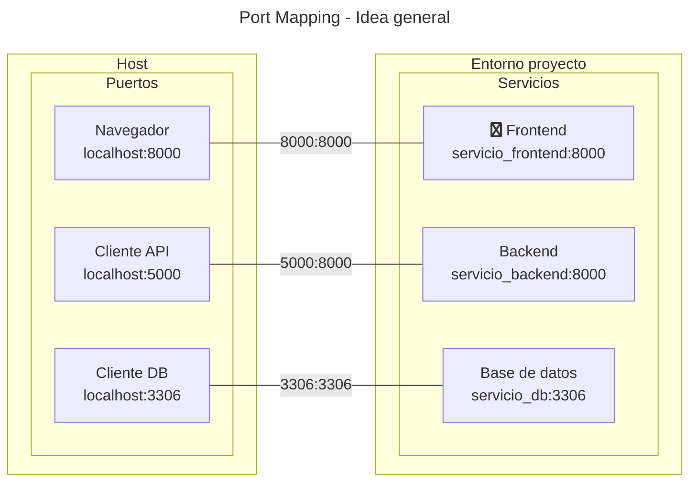

# Port Mapping


El *port mapping* o mapeo de puertos le permite
a las aplicaciones del sistema anfitrión
comunicarse con los contenedores 
mediante conexiones IP.

## Introducción

El *port mapping*
funciona de manera similar a un proxy reverso:
los clientes hacen una petición 
a la IP del gestor de contenedores
y éste redirige el tráfico
a alguno de los contenedores en actividad
en base al puerto usado.

Este es un esquema
típico del uso
de este recurso:



En este ejemplo el programa gestor
se reserva los puertos 
`8000`, `5000` y 
`3306` del sistema anfitrión.
Éste redirige el tráfico entrante a esos puertos
al programa *frontend* (interfaz de usuario final),
al programa backend (*login*, notificaciones, etc),
y a la base de datos, en ese orden.


En el caso de ambientes de desarrollo
es habitual que el despliegue y las consultas
se realicen en el equipo local, 
por lo cual las peticiones se hacen
al dominio "`localhost`" o `127.0.0.1`,
tal como se muestra en el esquema.
Nótese que múltiples contenedores
pueden tener imágenes que reserven
un mismo número de puerto,
incluso en un mismo proyecto.

!!! info "IPs y Puertos"

    Más sobre las IPs y sus conceptos relacionados: [ver anexo](../anexos/redes/ip.md)


## Sintaxis


### Dockerfile

En el archivo Dockerfile
habitualmente se agrega la cláusula `EXPOSE`
para indicar en qué puerto
la imagen estará preparada
para recibir peticiones IP:

```dockerfile title="Port mapping - Dockerfile"
EXPOSE NUMERO_PUERTO
```

Esta cláusula es meramente informativa
(agrega metadata a la imagen final)
y su uso es opcional.


### Compose


A cada contenedor que necesite ser accedido desde el exterior
se le configura el parámetro `ports`
asignando los números de los puertos de a pares:

```yaml title="Port mapping - compose.yml"
services:

  servicio_ip:
    image: imagen-servicio
    ports:
      - puerto_host:puerto_contenedor
```

Un mismo contenedor puede tener varios puertos mapeados
hacia el *host*.


El protocolo usado por el puerto
puede ser especificado de manera opcional:
 
```yaml title="Port mapping - compose.yml (con protocolos)"
services:

  servicio_ip:
    image: imagen-servicio
    ports:
      - puerto_host:puerto_contenedor/protocolo
```

donde las elecciones disponibles son `tcp` y `udp`.
Véase el [anexo sobre TCP y UDP](../anexos/redes/tcp_udp.md) para más información.


## Ejemplo: webapp con Python

Supóngase un servidor de una página web dinámica
implementada con el framework Flet,
que se utiliza con Python.

### Proyecto demo

Este es el árbol del proyecto:

```bash title="demo webapp - Árbol de archivos"
.
├── compose.yml
├── demo
│   └── main.py
├── Dockerfile
└── requirements.txt
```

Dentro del archivo de requisitos
se indica la versión de Flet requerida,
la cual debe ser un paquete completo:

```txt title="demo webapp - requirements.txt" 
flet[all]==0.26.0
```

El código del programa es un demo oficial de Flet
que consiste en un contador numérico
y un botón flotante.
Cuando se aprieta el botón
el contador se incrementa en uno.


```py title="demo webapp - Código fuente" 
# importación
import flet as ft


# Diseño de página y eventos
def main(page: ft.Page):

    #contador: barra de texto
    counter = ft.Text("0", size=50, data=0)

    # evento: contar cuando se clickea el botón
    def increment_click(e):
        counter.data += 1
        counter.value = str(counter.data)
        counter.update()

    # botón flotante
    page.floating_action_button = ft.FloatingActionButton(
        icon=ft.Icons.ADD, on_click=increment_click
    )

    # maquetado de página
    page.add(
        ft.SafeArea(
            ft.Container(
                counter,
                alignment=ft.alignment.center,
            ),
            expand=True,
        )
    )

# objeto desplegable con servidor (Uvicorn)
app = ft.app(main, export_asgi_app=True)
```

### Entorno virtual

La aplicación se instala localmente
en un entorno virtual
para probar su funcionamiento:

```bash title="demo webapp - Instalación (entorno virtual)" 
py -m venv .venv
source  .venv/bin/activate
pip install -r requirements.txt
```

La puesta en marcha 
en entorno local se realiza
con el servidor **Uvicorn**
el cual es llamado con el siguiente comando:

```bash title="demo webapp - Despliegue (entorno virtual)" 
cd demo/ 
uvicorn main:app --port 8000 --host 0.0.0.0
```

de manera que la página local podrá ser visitada 
con el navegador en la ruta [http://localhost:8000](http://localhost:8000).
En este ejemplo se eligió el puerto `8000`.


!!! tip "IP comodín"

    La IP `0.0.0.0` (comodín)
    se indica para que el servidor acepte peticiones
    desde cualquier IP válida.


### Despliegue con contenedores

Con el archivo Dockerfile
se adapta la instalación
y el comando de arranque
a una imagen de Python:

```dockerfile title="demo webapp - Dockerfile" hl_lines="14-15 17-18"
# imagen de referencia
FROM python:alpine

# directorio de trabajo (se crea automáticamente)
WORKDIR /code

# instalación de dependencias
COPY requirements.txt ./
RUN pip install -r requirements.txt --no-cache-dir 

# copia de rutinas al directorio de trabajo
COPY demo/ ./

# puerto de entrada (INFORMATIVO)
EXPOSE 8000

# comando, opciones y argumentos
CMD ["uvicorn", "main:app", "--port", "8000", "--host", "0.0.0.0"]
```

El mapeo entre anfitrión y contenedor
se realiza en el archivo `compose.yml`.
En este ejemplo se eligió
el puerto `9999` del *host*.

```yaml title="demo webapp - compose.yml" hl_lines="8-9"
name: demo-puertos

services:

  webapp-flet:    
    build: .        
    image: webapp-flet
    ports:
    - 9999:8000
```

El despliegue se realiza con el comando `compose`:

```bash title="demo webapp - Despliegue (con contenedor)"
podman compose up -d
```

Finalmente
para ver la página web en funcionamiento
se abre el navegador en la ruta [http://localhost:9999](http://localhost:9999).


<!-- 
## Ejemplo

Supóngase por ejemplo el despliegue
de una base de datos.
En este ejemplo se eligió un gestor de bases de datos PostgreSQL,
el cual por *default* acepta conexiones al puerto **5432**.
Para que el contenedor pueda ser consultado
se eligió arbitrariamente el puerto 9999
y además se necesita configurar algunos parámetros
como el nombre de usuario,
el nombre de la base de datos a crear
y una contraseña para el acceso,
lo que se hace con variables de entorno predefinidas.
 -->