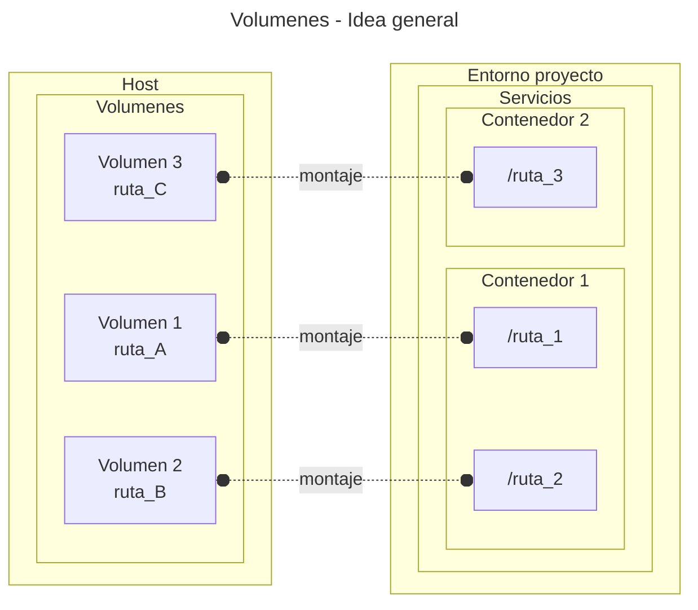

---
date:
    created: 2025-07-01
    updated: 2025-09-23
---

# Volumenes

Los volumenes son almacenamientos persistentes
ubicados en el sistema anfitrión
a los cuales los contenedores tienen acceso.
Son necesarios para prevenir
la pérdida de los datos internos de los contenedores
cada vez que éstos son borrados o recreados.

Algunos usos habituales:

- bases de datos;
- archivos de los usuarios;
- reportes de funcionamiento;
- etc.

## Introducción

Las rutas internas de los contenedores
están aisladas del sistema anfitrión.
Asimismo los contenedores
son incapaces de interactuar
con los directorios y archivos
del sistema anfitrión.
*host* directamente.

El gestor de contenedores
crea los volumenes
en una ruta permitida del anfitrión.
Luego crea un "punto de montaje"
(una equivalencia)
entre las rutas internas
de los contenedores
y las rutas internas de los volumenes.


<!-- 
!!! info "Puntos de montaje"

    En informática un *punto de montaje*
    es una equivalencia
    entre un recurso
    al que se requiere tener acceso
    (
    un archivo,
    un directorio,
    un dispositivo, 
    etc.
    )
    y una ruta del sistema local.
    Al proceso de crear dicha equivalencia
    se lo llama coloquialmente "montar".

    En el caso de los contenedores
    los puntos de montaje consisten
    en equivalencias entre
    rutas internas del contenedor
    y rutas del sistema anfitrión.
 -->




De esta manera
los contenedores tienen acceso limitado
al sistema de archivos del anfitrión
a través de los volumenes.
Si los contenedores son eliminados
los volumenes y sus contenidos siguen existiendo
y pueden ser reutilizados, migrados, etc.


## Asignación de volumenes

El acceso de los contenedores
a los volumenes se indica 
mediante el campo `volumes`
del archivo `compose.yml`.
Un mismo proyecto permite definir múltiples volumenes;
además un mismo contenedor puede acceder
a varios volumenes simultáneamente.

Hay varias variantes de volumenes
que pueden ser creados,
las cuales se muestran a continuación.

### Volumenes anónimos

Los volumenes anónimos se crean
asignando un único valor
que corresponde a la ruta interna del contenedor:

```yaml title="compose.yml - volumenes anónimos"
name: nombre_proyecto

services:

  servicio_volumen:
    build: .
    # lista de rutas internas
    volumes:
      - ruta_contenedor
```

En este caso el programa gestor de los contenedores
crea un volumen y le reserva al contenedor un directorio
para guardar los datos persistentes.

Si el despliegue se realiza en sistemas GNU/Linux
entonces los voúmenes se suelen alojar en la ruta
`/home/USUARIO/.local/share/containers/storage/volumes/`

Al volumen anónimo se le asigna un nombre aleatorio
de manera automática.
Este tipo de volumenes 
es práctico para datos 
que no requieran ser transferidos
ni preservados por mucho tiempo:
cachés, algunos archivos de configuración, etc.


<!-- 
Al volumen anónimo se le asigna un nombre automáticamente
que está compuesto por el nombre del proyecto,
el nombre del servicio que lo usa
y una secuencia aleatoria.
Por ejemplo en este caso
el volumen sería llamado como
`nombre_proyecto_servicio_volumen_1c7d7b...`.
 -->

<!-- 
Esto es relevante si se necesita realizar
la inspección del volumen (ver más adelante).
 -->

### Volumenes con nombre

Los volumenes con nombre
son similares a los volumenes anónimos.
En este caso a cada ruta interna del contenedor
se le asigna un nombre
que funciona como un alias.

```yaml title="compose.yml - volumenes con nombre"
name: nombre_proyecto

services:

  servicio_volumen:
    build: .
    # lista de volumenes accedidos
    volumes:
      # montajes (equivalencias)
      - nombre_volumen:/root/logs


# lista de volumenes implementados
volumes:
  nombre_volumen:
```

El nombre asignado al volumen 
suele estar compuesto por el nombre del proyecto
y el alias definido para el volumen.
Por ejemplo en este caso
el volumen se llamaría
`nombre_proyecto_alias_volumen`.

Este tipo de volumenes puede ser accedido
por múltiples contenedores mediante su alias.
Si el volumen requerido proviene de otro proyecto
entonces hace falta especificar el parámetro `external`
como `true`:

```yaml title="compose.yml - volumenes externos"
# lista de volumenes implementados
volumes:
  nombre_volumen:
    external: true
    name: nombre_completo_volumen
```

Los volumenes con nombre
son una buena opción para datos
que necesiten ser preservados
y posiblemente transferidos a otras plataformas:
bases de datos de producción,
publicaciones de usuarios
(ej: entradas de WordPress),
etc.
pero que no necesiten ser manipulados
frecuentemente
por desarrolladores ni administradores.

### Volumenes de host

En este tipo de asignación
no se crea un elemento de volumen
sino que se monta una ruta del sistema anfitrión 
(el host) a la ruta de interés del contenedor.

```yaml title="compose.yml - volumenes de host"
services:

  servicio_volumen:
    build: .
    # lista de volumenes accedidos
    volumes:
      # montajes (equivalencias)
      -  ruta_host:ruta_contenedor
    # opciones de seguridad
    security_opt: 
      - label=disable
```

Si la ruta indicada en el sistema host no existe
entonces se creará automáticamente.

Este tipo de volumenes es práctico
para darle un acceso inmediato
de los archivos 
a desarrolladores y administradores del proyecto.

!!! tip "Read only"

    Los volumenes admiten el montaje
    en el modo
    de sólo lectura (*read only*).
    Esto se realiza agregando `:ro`
    detraś de los mapeos como se muestra:


    ```yaml hl_lines="6" title="compose.yml - read only"
    services:

      servicio_volumen:
        build: .
        volumes:
          -  ruta_host:ruta_contenedor:ro
        security_opt: 
          - label=disable
    ```


!!! warning "Security Options"

    El atributo `security_opt`
    es opcional en Docker
    pero es indispensable en Podman
    para otorgar y configurar los permisos de acceso
    a los recursos del host
    por parte del contenedor.
    Haciendo `label=disable`
    se libera el acceso al contenedor
    de los recursos del usuario actual del sistema
    pero no se da acceso a los recursos
    que requieran permisos de administrador.


## root 

### Usuario root


En los contenedores que corren imágenes basadas en Linux
el usuario predeterminado
es el usuario `root` ("raiz"),
que es el usuario administrador del sistema.
Su carpeta de usuario se encuentra
en la carpeta `/root`,
en contraposición a los usuarios comunes,
que tienen sus archivos de usuario
dentro de la carpeta `/home`.


### Permisos de root

Docker hace funcionar a los contenedores
con plenos permisos de administrador.
Por este motivo
en Docker el usuario `root`
de cada contenedor
posee todos los permisos
de administrador por *default*.
Esto puede implicar un riesgo de seguridad,
la llamada "escalada de permisos",
si a los contenedores
se les da un acceso demasiado permisivo
a los recursos del sistema anfitrión.

Esto es diferente en Podman,
el cual funciona en modo *rootless*
(sin permisos de superusuario)
por *default*
y por tanto el usuario *root* de cada contenedor
no tiene dichos permisos especiales
a menos que se inicie Podman en modo *rootful* deliberadamente.


## Ejemplo demo


En este demo se adapta la rutina del contador
pero en este caso los logs salen por consola
y por archivo en simultáneo.
El archivo es creado 
con el nombre `reporte.log` y los reportes son acumulativos.

???+ example "demo contar" 

    ```py title="contar.py" hl_lines="7 12-22"
    from time import sleep
    from pathlib import Path
    import sys
    import logging

    # ruta al reporte (en contenedor) : /root/logs/reporte.log
    ruta_log = Path( "~/logs/reporte.log").expanduser()

    logging.basicConfig(
        level=logging.INFO, # mínimo nivel de log a publicar
        format="%(asctime)s - %(levelname)s - %(message)s", #info incorporada
        handlers=[
            # salida por consola
            logging.StreamHandler(), 
            # salida por archivo
            logging.FileHandler(
                filename=ruta_log,
                mode="a",
                encoding="utf-8",
                delay=True,
                ),
            ],
        )

    try:
        # el numero maximo a contar se asigna como argumento
        n = int(sys.argv[1])
        logging.info("Contando hasta %i", n)

    except Exception:
        # valor máximo por default en caso de error
        logging.warning("Argumento de entrada faltante o incorrecto (debe ser un entero)")
        n = 10
        logging.warning("Contando hasta %i (valor default)", n)

    finally:
        # el contador se incrementa cada 1 segundo
        i = 0
        while i <= n:
            logging.info("i: %4i",i)
            sleep(1)
            i += 1
    ``` 

    ``` Dockerfile title="Dockerfile"
    # imagen de referencia
    FROM python:alpine

    # directorio de trabajo (se crea automáticamente)
    WORKDIR /code

    # copia de rutinas al directorio de trabajo
    COPY demo/ ./

    # comando, opciones y argumentos fijos
    ENTRYPOINT ["python", "contar.py"]

    # opciones y argumentos sobreescribibles
    CMD ["4"]
    ``` 

    A continuación se muestran varias implementaciones alternativas
    de la gestión de volumenes:

    === "Volumen anónimo"

        ``` bash title="Arbol de archivos"
        .
        ├── compose.yml
        ├── Dockerfile
        └── demo
            └── contar.py
        ```

        ```yaml title="compose.yml"
        name: demo_volumen

        services:

          servicio_volumen:
            build: .
            volumes:
              - /root/logs
        ```

    === "Volumen con nombre"

        ``` bash title="Arbol de archivos"
        .
        ├── compose.yml
        ├── Dockerfile
        └── demo
            └── contar.py
        ```

        ```yaml title="compose.yml"
        name: demo_volumen

        services:

          servicio_volumen:
            build: .
            volumes:
              - registro_persistente:/root/logs


        volumes:
          registro_persistente:
        ```

    === "Volumen de host"

        ``` bash title="Arbol de archivos"
        .
        ├── compose.yml
        ├── Dockerfile
        ├── demo
        │   └── contar.py
        └── registro
            └── reporte.log
        ```

        ```yaml title="compose.yml"
        name: demo_volumen

        services:

          servicio_volumen:
            build: .
            volumes:
              - ./registro:/root/logs
            security_opt: 
              - label=disable
        ```

## Manejo manual

### Listar e inspeccionar

La lista de volumenes existentes se consulta
con el comando `volume list`:

```bash title="Volumenes - Listado"
podman volume list
```

Los parámetros del volumen de interés
se consultan con el comando `volume inspect`:


```bash title="Volumenes - Inspección"
podman volume inspect NOMBRE_VOLUMEN 
```

La ruta al contenido del volumen
se indica dentro del campo `Mountpoint`.
Su valor se puede consultar así:

```bash title="Volumenes - Ubicación"
podman volume inspect NOMBRE_VOLUMEN --format='{{.Mountpoint}}'
```

Accediendo a esta ruta se podrá acceder a los datos
para realizar copias de seguridad,
restablecer los datos,
realizar una migración de plataforma, etc.

!!! tip "Gestión gráfica"

    Las aplicaciones de escritorio de Docker y de Podman
    permiten visualizar y administrar los volumenes existentes de manera gráfica.

### Creación

Los volumenes se pueden crear deliberadamente
con el comando `create`:

```bash title="Volumenes - Creación (con nombre)"
podman volume create  NOMBRE_VOLUMEN
```
El nombre asignado servirá para poder ser accedido
desde los contenedores como volumen externo:

```yaml title="compose.yml - volumen externo"
services:

  volumen_nombre:
    build: .
    volumes:
      - NOMBRE_VOLUMEN:/root/logs


volumes:
  NOMBRE_VOLUMEN:
    external: true 
```


### Borrado

A los volumenes 
y a su contenido
se los borra
uno a uno
con el comando `remove`:

```bash title="Volumenes - Borrado"
podman volume remove NOMBRE_VOLUMEN
```


!!! danger "Borrar no usados"

    Los volumenes no utilizados por ningún contenedor
    se pueden borrar en masa automátícamente
    con el comando `prune` ("podar"):

    ```bash title="Volumenes - Borrado (no utilizados)"
    podman volume prune
    ```

    Esta opción debe usarse con mucho cuidado,
    dado que puede haber volumenes
    con datos de producción
    que estén huérfanos al momento de ejecutar este comando.

  

